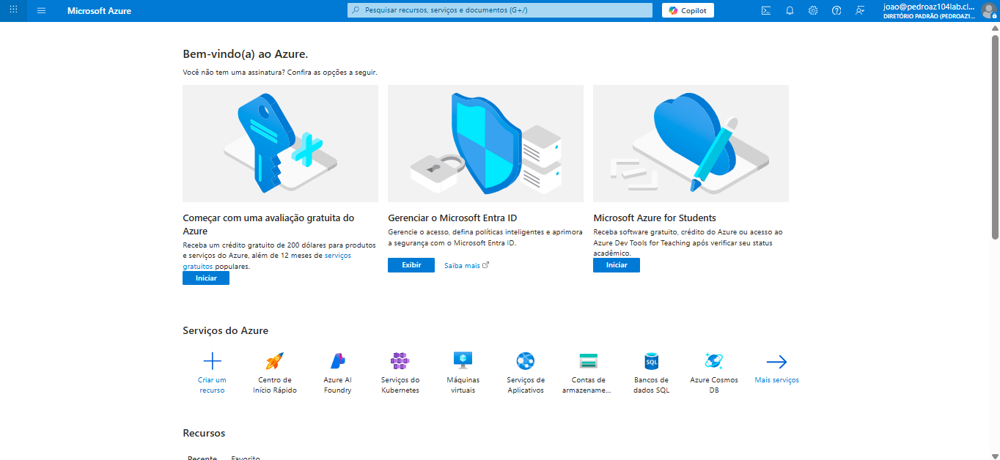
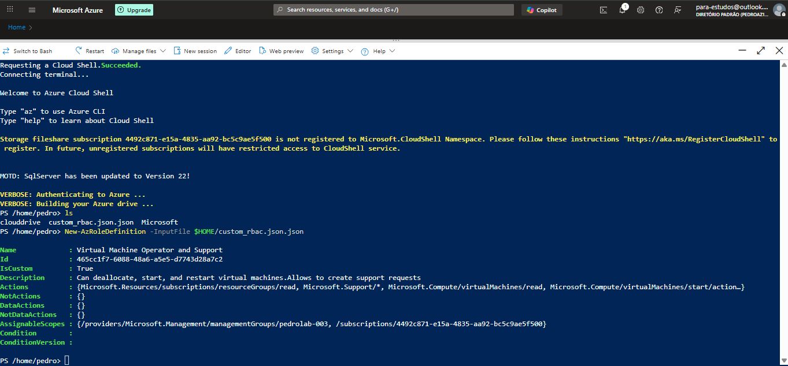
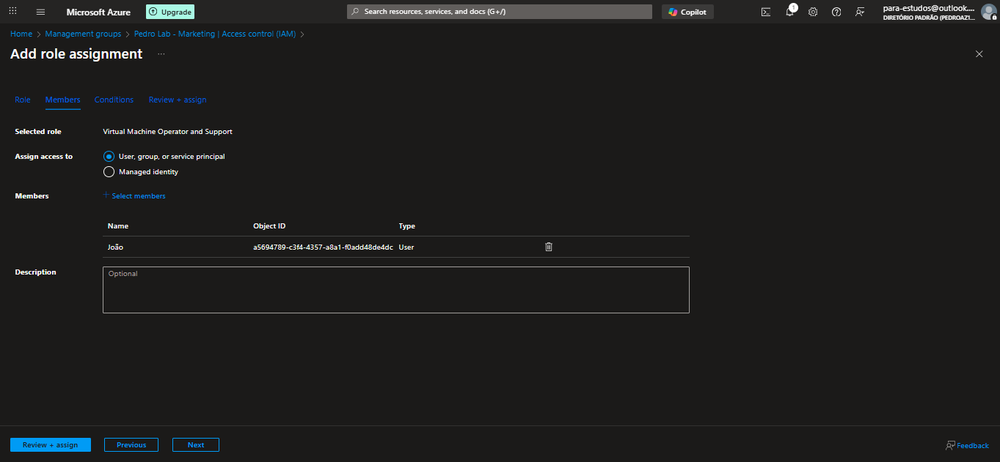
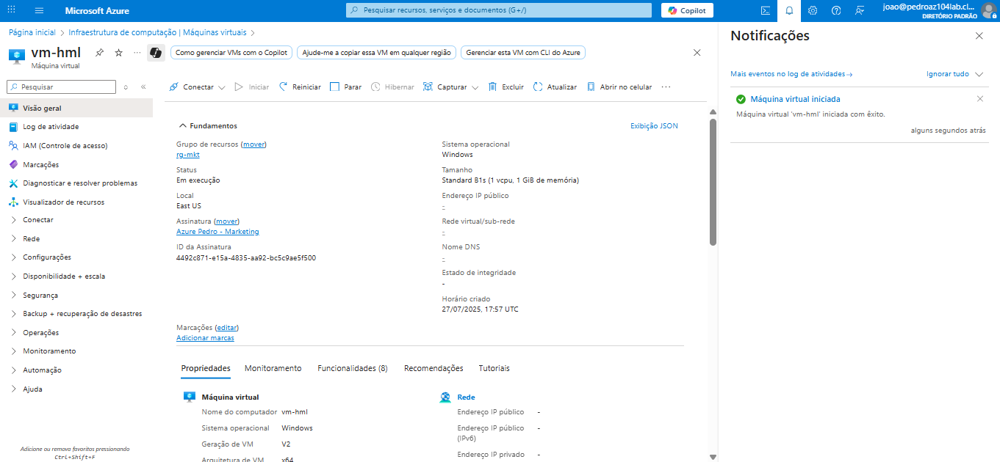
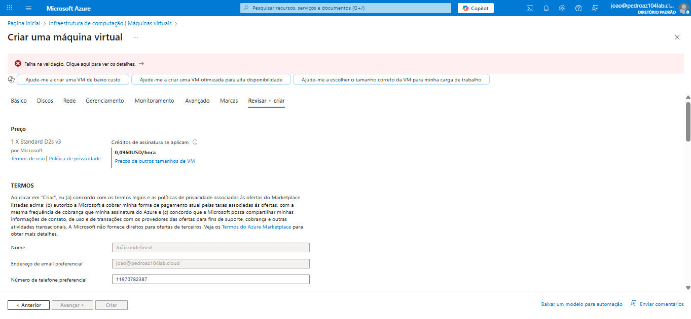
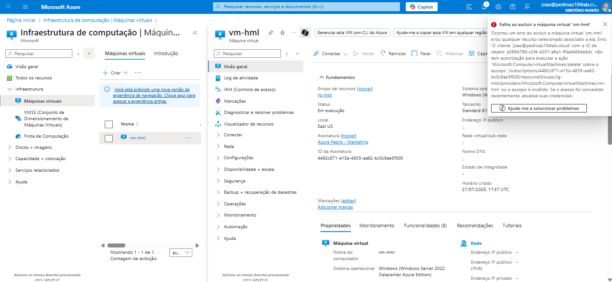

# Custom RBAC Role

Este laboratório simula um cenário de governança em que um operador de suporte precisa gerenciar máquinas virtuais no Azure com permissões específicas.

O objetivo foi criar uma **role personalizada (RBAC)** com permissões mínimas, permitindo que o usuário **inicie, reinicie e pare VMs**, mas **sem permissão para criar ou excluir recursos**.

---

## 🔧 1. Criação do usuário de teste

Foi criado o usuário **João** no Microsoft Entra ID, para simular o papel de operador de suporte técnico.  
Esse usuário seria usado para validar o comportamento da role personalizada.

📸 

---

## 📄 2. Definição da Role Personalizada

Foi criado um arquivo `custom_rbac.json` com o seguinte conteúdo:

```json
{
  "Name": "Virtual Machine Operator and Support",
  "IsCustom": true,
  "Description": "Can deallocate, start, and restart virtual machines. Allows to create support requests",
  "Actions": [
    "Microsoft.Resources/subscriptions/resourceGroups/read",
    "Microsoft.Support/*",
    "Microsoft.Compute/virtualMachines/read",
    "Microsoft.Compute/virtualMachines/start/action",
    "Microsoft.Compute/virtualMachines/restart/action",
    "Microsoft.Compute/virtualMachines/deallocate/action"
  ],
  "NotActions": [],
  "AssignableScopes": [
    "/subscriptions/MEU-ID",
    "/providers/Microsoft.Management/managementGroups/pedrolab-003"
  ]
}
```

Esse script define uma role que permite:
- Leitura de Resource Groups
- Abertura de chamados (Microsoft.Support)
- Operações básicas de VM: iniciar, reiniciar, desalocar

Não permite:
- Criar VMs
- Excluir VMs
- Alterar configurações

📸 

O comando utilizado foi:

```powershell
New-AzRoleDefinition -InputFile $HOME/custom_rbac.json.json
```

---

## 👥 3. Atribuição da role ao usuário João

Após a criação da role, ela foi atribuída ao usuário João no escopo do management group `Pedro Lab - Marketing`.

📸 

---

## 🧪 4. Testes com a conta do João

Em seguida, foi feito login com a conta do João para testar o comportamento da role.

### ✅ Ações permitidas:

- Iniciar VM com sucesso  
- Parar VM com sucesso  
- Reiniciar VM com sucesso

📸 

---

### ❌ Ações bloqueadas (esperado):

- **Criação de nova VM:** João tentou criar uma VM e recebeu erro de permissão (ação não permitida pela role).

📸 

- **Exclusão de VM:** Também foi feito um teste para excluir uma VM e, como esperado, a permissão foi negada.

📸 

---

## ✅ Conclusão

A role personalizada funcionou exatamente como planejado.  
Ela permitiu que o operador de suporte executasse tarefas básicas de operação em máquinas virtuais, sem dar acesso a recursos sensíveis.

Este teste demonstra como aplicar o conceito de **mínimos privilégios** no Azure com RBAC personalizado — um recurso muito útil para ambientes corporativos com políticas de segurança rígidas.
