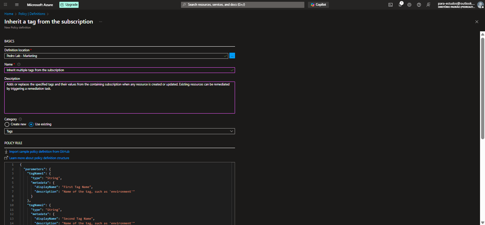
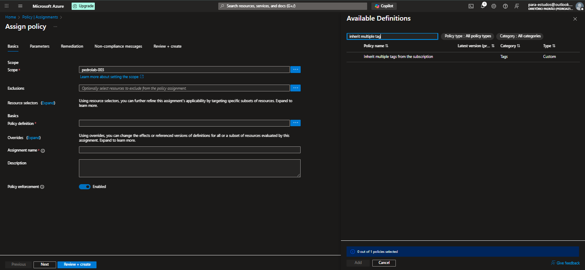
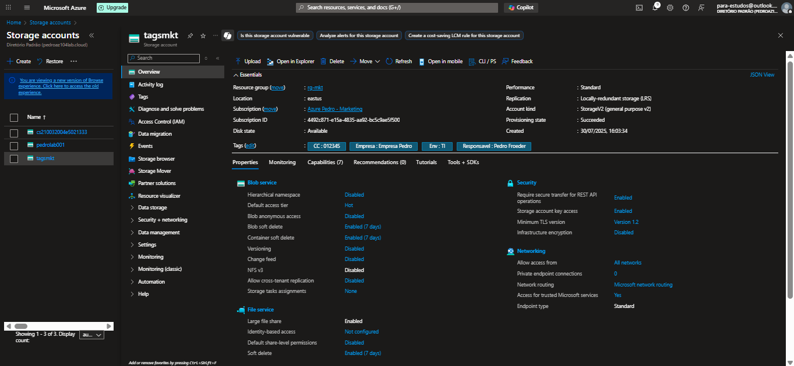

# Custom Azure Policy

Este laboratório demonstra como criar uma **Azure Policy personalizada** que **herda múltiplas tags** definidas na subscription e as aplica automaticamente a todos os recursos criados.

O objetivo foi evitar falhas humanas na aplicação de tags obrigatórias, promovendo consistência e governança nos metadados dos recursos.

---

## 🔧 1. Criação das Tags na Subscription

Foram definidas manualmente duas tags diretamente na subscription:

- `env = MKT`
- `Responsavel = Pedro Froeder`

Essas tags seriam herdadas automaticamente por todos os recursos criados nela.

---

## 📄 2. Definição da Policy Personalizada

A partir da policy existente **"Inherit a tag from the subscription"**, foi utilizada a opção **Duplicate definition** e o código foi ajustado para permitir a herança de **duas tags**.

### 📁 Arquivo `custom_policy.json`

```json
{
  "parameters": {
    "tagName1": {
      "type": "String",
      "metadata": {
        "displayName": "First Tag Name",
        "description": "Name of the tag, such as 'environment'"
      }
    },
    "tagName2": {
      "type": "String",
      "metadata": {
        "displayName": "Second Tag Name",
        "description": "Name of the tag, such as 'environment'"
      }
    }
  },
  "policyRule": {
    "if": {
      "anyOf": [
        {
          "field": "[concat('tags[', parameters('tagName1'), ')]",
          "exists": "false"
        },
        {
          "field": "[concat('tags[', parameters('tagName2'), ')]",
          "exists": "false"
        }
      ]
    },
    "then": {
      "effect": "modify",
      "details": {
        "roleDefinitionIds": [
          "/providers/Microsoft.Authorization/roleDefinitions/b24988ac-6180-42a0-ab88-20f7382dd24c"
        ],
        "operations": [
          {
            "operation": "add",
            "field": "[concat('tags[', parameters('tagName1'), ')]",
            "value": "[subscription().tags[parameters('tagName1')]]"
          },
          {
            "operation": "add",
            "field": "[concat('tags[', parameters('tagName2'), ')]",
            "value": "[subscription().tags[parameters('tagName2')]]"
          }
        ]
      }
    }
  }
}
```

📸 

---

## 👥 3. Atribuição da Policy

A policy foi atribuída no escopo da subscription `pedrolab-003`, preenchendo os parâmetros:

- `tagName1 = env`
- `tagName2 = Responsavel`

📸 

---

## 🧪 4. Teste Prático

Foi criada uma nova **Storage Account** chamada `tagsmkt`. Ao acessar a seção de tags do recurso, foi validado que as tags obrigatórias foram aplicadas automaticamente:

- `env = MKT`
- `Responsavel = Pedro Froeder`

📸 

---

## ✅ Conclusão

A Azure Policy personalizada funcionou conforme esperado. Ela permitiu que as tags definidas na subscription fossem herdadas automaticamente por novos recursos.

Este teste demonstra como aplicar o conceito de **governança de metadados** no Azure com Azure Policy personalizada — uma prática comum em ambientes corporativos que buscam padronização e rastreabilidade.
